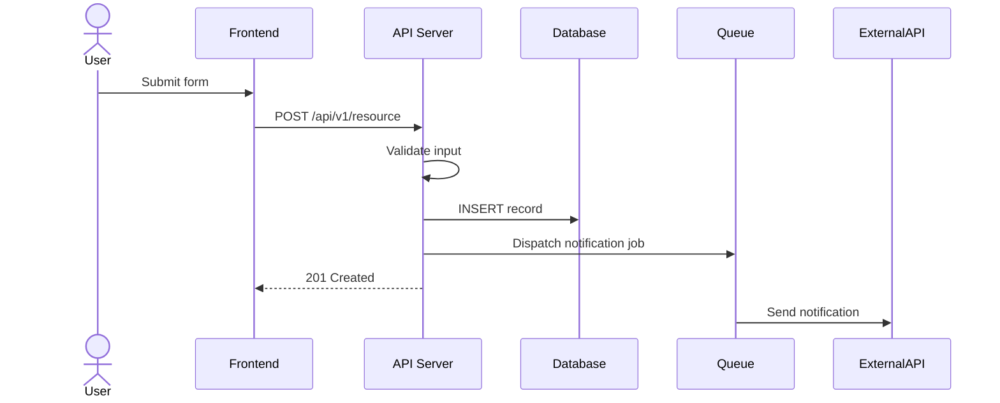
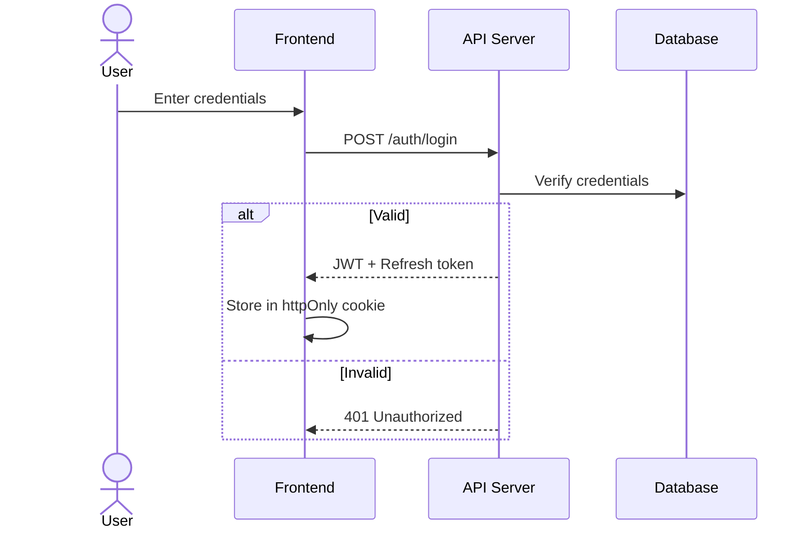
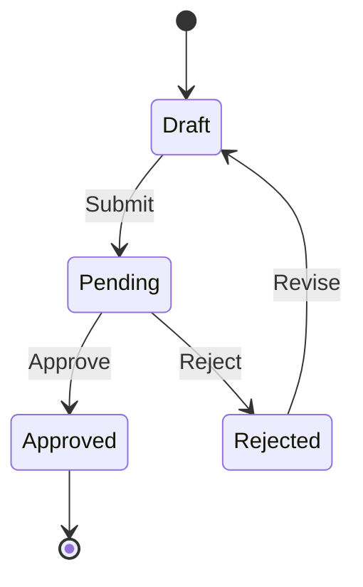
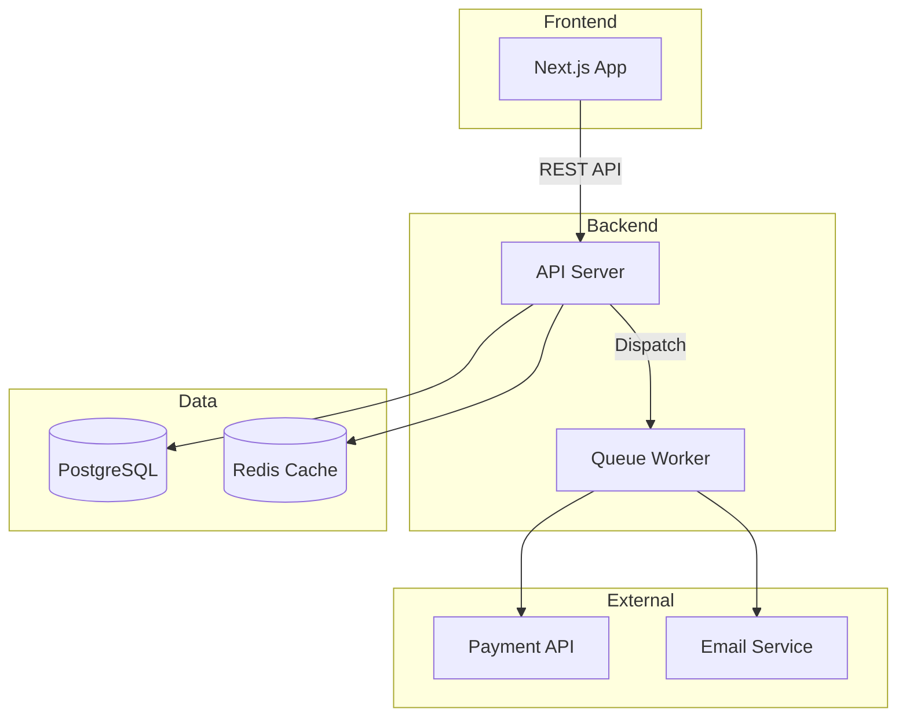

# Data Flow Template

> Sử dụng Mermaid diagrams cho luồng dữ liệu.

```markdown
# 🔄 Data Flow — [Project Name]
> Updated: YYYY-MM-DD

## 1. [Core Flow Name]



## 2. [Authentication Flow]



## 3. [State Diagram Example]



## N. System Overview


```
